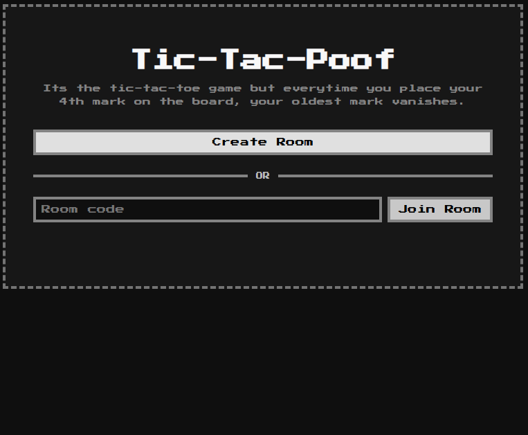
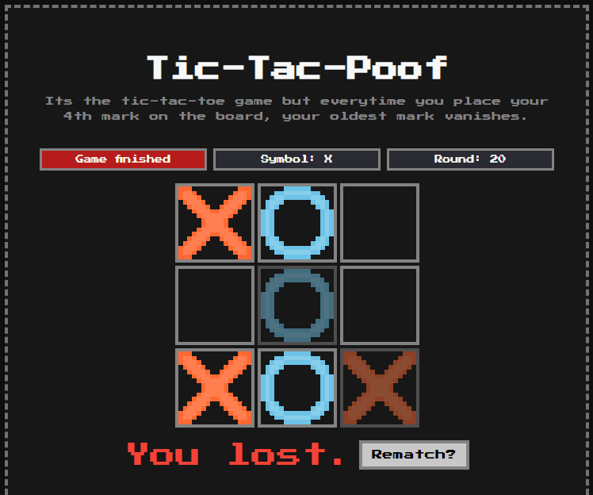

# Tic-Tac-Poof
Its the Tic-Tac-Toe game but everytime you place your 4th mark on the board, your oldest mark vanishes.
(Not an original idea. based on a toy i saw before)

## Features
- Room-based multiplayer is implemeneted using Socket.IO. first player can create a room and send the room code to the other player to join.
- I have tried to keep the code minimal and simple. frontend is just html and js. backend uses express and socket.io
- it can be tested locally with 2 tabs or browsers, or it can be deployed on a host to play  remotely.

## Screenshots

